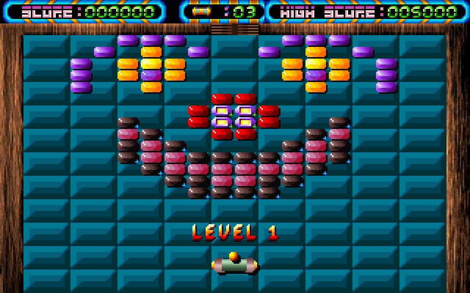

# Krypton Egg

An Android remake of **Krypton Egg**, the Breakout game by Alexandre Kral
(Atari ST and Amiga, 1989) in its Windows CD version published by C2V in
1996. You move a racket along the bottom of the screen and bounce a ball into
walls of bricks. Catch the spells that fall out of broken bricks, and shoot or
dodge the monsters that come through the door at the top.
**No ads, no in-app purchases, no analytics.**

<p align="center">
  
</p>

## Download

**Direct APK download:**
https://github.com/Matswm86/krypton-egg/releases/download/latest/krypton-egg.apk

1. Open that link in your phone's browser and download the file.
2. Open the downloaded file. If Android says it is not allowed to install
   unknown apps from this source, tap **Settings**, turn on
   **Allow from this source**, go back and install.
3. The app appears as **Krypton Egg** and runs in landscape.

The APK is debug-signed with a fixed key, so a newer build installs over an
older one.

## Controls

- **Slide a finger** anywhere on the screen to move the racket. The racket
  follows the finger's movement, like a mouse, so your finger never covers it.
- **Tap** to launch the ball, and to fire when the racket carries a laser or
  a cannon.
- **Back** pauses the game. Back again while paused returns to the menu.
- On a keyboard: left and right arrows move, space launches, Escape pauses.

## What comes from the original

Everything you see and hear was decoded from the original game files on the
*C2V Games Suite* CD (1996), preserved on
[archive.org](https://archive.org/details/c2v-game-suite):

- **All 100 levels**, byte for byte, including each level's ball speed and
  its list of monster types.
- **All graphics**: 256 brick sprites, 66 monster frames, 49 racket frames,
  90 spell and ball frames, the floor tiles, the wooden walls, the score
  panels, the menu, the title picture and the high-score picture.
- **All 45 sound effects** and the music: title, menu, scores, info, pause,
  game over, and the CD soundtrack pieces that play under the cutscenes.
- **Five of the eight cutscenes** (320 x 200 FLI animations): the C2V logo,
  the space-ship intro, the racket flying into the playfield when a game
  starts, and the flight between planets after every 10 levels. The last
  level ends with the planet explosion. The tunnel, zoom and spinning-racket
  clips are baked into the APK but not placed yet.

The game uses the original 320 x 200 screen and the original playfield
layout, scaled up to fill the phone's height.

## What I had to decide

The CD does not describe what each brick and spell does; that logic lives in
the 16-bit program code. These rules are my reading of the sprites, the
sound names and the original help text, not a port of the original code:

- **Bricks.** Plain bricks break in one hit. Bricks with one to three blue
  plus marks need that many extra hits. Framed bricks lose the frame on the
  first hit. Cracked stone needs two hits. The grey and greek-key metal
  frames do not count toward clearing the stage and break after six hits, so
  no stage can lock up. Checkered and flame bricks explode and take their
  neighbours with them.
- **Spells.** 18 spells, each drawn with its original icon: longer racket,
  shorter racket, glue, multiple ball, bigger ball, fire ball, laser, cannon,
  slow ball, fast ball, frozen tray, shield, dynamite, fly, mystery, extra
  racket, reversed controls and small ball. The INFO screen lists them with
  their icons.
- **Monsters** follow the original rule from the help text: you can touch
  most of them, but the picus vulgarus kills a racket that has no shield.
- **Worlds.** Every 10 levels finished unlocks that world on the PLAY menu,
  in place of the original's passwords.

Not in this version yet: the horde-attack stages and the final-monster
battles. Their graphics and music are on the CD, but how they played has to
be rebuilt from scratch.

## Building

The APK is built by GitHub Actions (`.github/workflows/build-android.yml`)
with Godot 4.6.2. To rebuild the assets from the CD yourself:

```sh
# 1. Unpack KRYPTON/COM/CDROM/KE.RSC from the CD image, then:
python3 tools/carve_cd.py KE.RSC /tmp/ke
python3 tools/bake_assets.py /tmp/ke
```

`tools/carve_cd.py` splits the resource file (most of it is stored with every
byte inverted), `tools/gaf.py` and `tools/dig.py` decode C2V's GAF sprite and
sample banks, and `scripts/fli_player.gd` plays the FLI cutscenes on the
phone.

Krypton Egg is © Alexandre Kral and C2V. This is a fan remake for people who
played it on Windows in the nineties.
